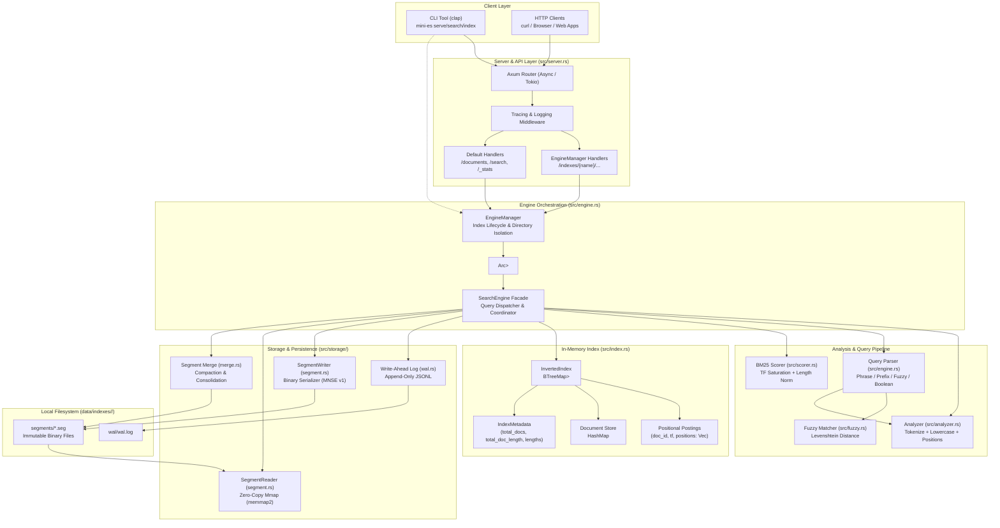
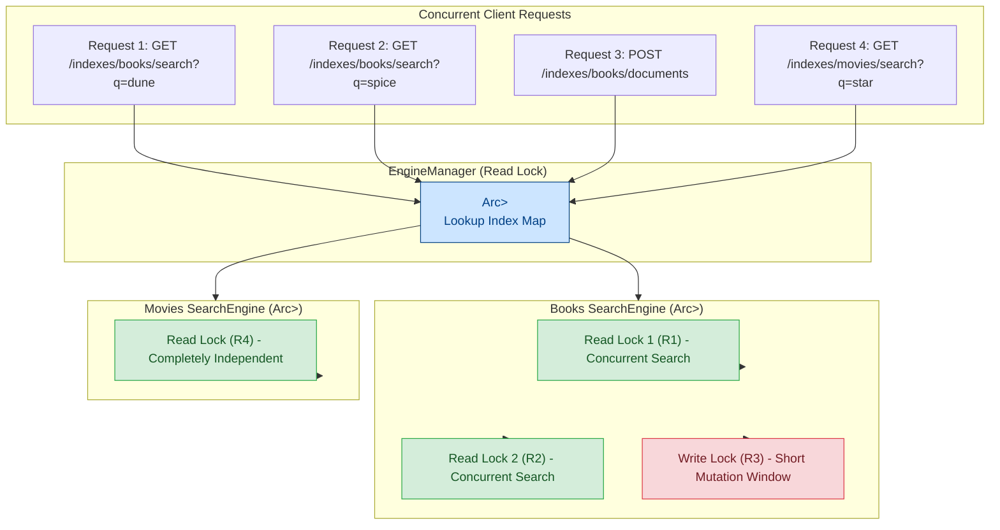
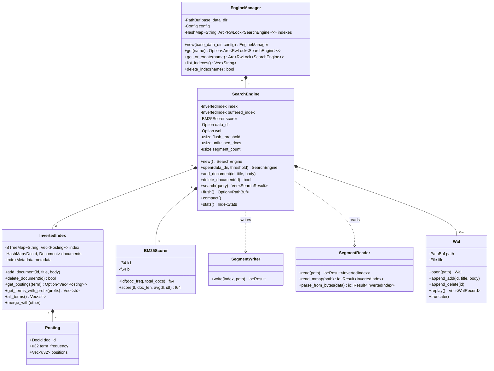

# Mini-Elasticsearch: System Architecture & Flow Diagrams

This document provides architectural diagrams, sequence flows, and data structure layouts explaining the entire Mini-Elasticsearch engine from Phase 1 through Phase 7.

---

## 1. High-Level System Architecture



---

## 2. Document Ingestion & Indexing Pipeline

This sequence diagram illustrates what happens when a document is added via `POST /indexes/{name}/documents` or through the CLI.

```mermaid
sequenceDiagram
    autonumber
    actor Client as Client (HTTP / CLI)
    participant Server as Axum Server (server.rs)
    participant Mgr as EngineManager (engine.rs)
    participant Engine as SearchEngine (engine.rs)
    participant WAL as Write-Ahead Log (wal.rs)
    participant Disk as Disk Storage (data/...)
    participant Analyzer as Analyzer (analyzer.rs)
    participant Index as InvertedIndex (index.rs)
    participant Writer as SegmentWriter (segment.rs)

    Client->>Server: POST /indexes/books/documents {id, title, body}
    Server->>Mgr: get_or_create("books")
    Mgr-->>Server: Arc<RwLock<SearchEngine>>
    Server->>Engine: acquire write lock -> add_document(id, title, body)
    
    rect rgb(240, 248, 255)
        Note over Engine,Disk: Step 1: Durability (WAL)
        Engine->>WAL: append_add(id, title, body)
        WAL->>Disk: Append newline-delimited JSON & flush to wal.log
    end

    rect rgb(255, 250, 240)
        Note over Engine,Index: Step 2: Positional Analysis & Indexing
        Engine->>Analyzer: analyze_with_positions(title, 0)
        Analyzer-->>Engine: title_tokens [(term, pos)]
        Engine->>Analyzer: analyze_with_positions(body, body_offset)
        Analyzer-->>Engine: body_tokens [(term, pos)]
        Engine->>Index: add_document(id, title, body)
        Index->>Index: Store Document(id, title, body)
        Index->>Index: Update term frequencies & positions in BTreeMap
        Index->>Index: Update IndexMetadata (total_docs, total_len, doc_lens)
    end

    rect rgb(240, 255, 240)
        Note over Engine,Writer: Step 3: Buffer & Flush Evaluation
        Engine->>Engine: unflushed_docs += 1
        alt unflushed_docs >= flush_threshold
            Engine->>Writer: SegmentWriter::write(&buffered_index, path)
            Writer->>Disk: Write binary segment file (segment_*.seg)
            Engine->>WAL: truncate() (reset wal.log to 0 bytes)
            Engine->>Engine: unflushed_docs = 0; segment_count += 1
        end
    end

    Engine-->>Server: success
    Server-->>Client: 201 Created { "status": "indexed", "id": "..." }
```

---

## 3. Query Parsing, Search & BM25 Ranking Pipeline

```mermaid
flowchart TD
    Start([Incoming Query String: query]) --> Parse{Parse Query Syntax}

    Parse -->|Starts & ends with double quotes| PhraseQuery["Phrase Mode: QueryMode::Phrase(terms)\ne.g. '\"ogre kidnapped\"'"]
    Parse -->|Single token ending with '*'| PrefixQuery["Prefix Mode: QueryMode::Prefix(prefix)\ne.g. 'ogr*'"]
    Parse -->|Single token with '~' or '~N'| FuzzyQuery["Fuzzy Mode: QueryMode::Fuzzy(term, dist)\ne.g. 'ogr~1'"]
    Parse -->|Contains uppercase 'OR'| OrQuery["Standard OR Mode: QueryMode::Standard(terms, true)\ne.g. 'ogre OR dragon'"]
    Parse -->|Default whitespace tokens| AndQuery["Standard AND Mode: QueryMode::Standard(terms, false)\ne.g. 'ogre bride'"]

    %% Phrase Execution
    PhraseQuery --> CheckTermsInIndex{All terms in index?}
    CheckTermsInIndex -->|No| EmptyResults([Return Empty Results])
    CheckTermsInIndex -->|Yes| IntersectDocs[Intersect Postings to find candidate docs]
    IntersectDocs --> AdjacencyCheck{Positional Adjacency Check\npos[t2] = pos[t1]+1 ?}
    AdjacencyCheck -->|Yes| MatchedPhraseDocs[Candidate Document IDs]
    AdjacencyCheck -->|No| EmptyResults

    %% Prefix Execution
    PrefixQuery --> PrefixRange["BTreeMap::range([prefix, next_prefix))\nExtract all matching vocabulary terms"]
    PrefixRange --> PrefixUnion[Union postings across all matched terms]
    PrefixUnion --> MatchedPrefixDocs[Candidate Document IDs]

    %% Fuzzy Execution
    FuzzyQuery --> FuzzyScan["Scan all vocabulary terms with levenshtein()\nFilter distance <= max_distance"]
    FuzzyScan --> FuzzyUnion[Union postings across all matched terms]
    FuzzyUnion --> MatchedFuzzyDocs[Candidate Document IDs]

    %% Standard Execution
    OrQuery --> OrUnion[Union postings across terms]
    OrUnion --> MatchedStdDocs[Candidate Document IDs]
    AndQuery --> AndIntersect[Intersect postings across terms]
    AndIntersect --> MatchedStdDocs

    %% Scoring & Ranking
    MatchedPhraseDocs --> BM25Scorer
    MatchedPrefixDocs --> BM25Scorer
    MatchedFuzzyDocs --> BM25Scorer
    MatchedStdDocs --> BM25Scorer

    subgraph BM25ScoringEngine["BM25 Relevance Scoring (src/scorer.rs)"]
        BM25Scorer["For each document in candidates:"]
        CalcIDF["1. Compute IDF(term) = ln(TotalDocs / DocFreq)"]
        CalcTFNorm["2. Length Normalization: dl / avgdl"]
        CalcScore["3. Score = IDF * (tf * (k1 + 1)) / (tf + k1 * (1 - b + b * dl/avgdl))"]
        SumScores["4. Accumulate scores across query terms"]
        BM25Scorer --> CalcIDF --> CalcTFNorm --> CalcScore --> SumScores
    end

    SumScores --> SortDesc["Sort candidate results by BM25 score descending"]
    SortDesc --> FormatHit["Construct SearchHit { doc_id, title, score }"]
    FormatHit --> Response([Return SearchResponse JSON with took_ms])
```

---

## 4. Segment Binary Format (Disk Layout)

Each flushed segment is stored as a self-contained binary file (`.seg`) structured into 4 sequential sections:

```text
+-------------------------------------------------------------------------------+
| SECTION 1: HEADER (40 Bytes)                                                  |
| - Magic Bytes: b"MNSE" (4 bytes)                                              |
| - Format Version: 1u32 (4 bytes)                                              |
| - Number of Terms: u32 (4 bytes)                                              |
| - Number of Documents: u32 (4 bytes)                                          |
| - Total Document Length: u64 (8 bytes)                                        |
| - Postings Section Byte Offset: u64 (8 bytes)                                 |
| - Document Store Section Byte Offset: u64 (8 bytes)                           |
+-------------------------------------------------------------------------------+
| SECTION 2: TERM DICTIONARY                                                    |
| For each term (in sorted lexicographical order):                              |
| - term_len: u16                                                               |
| - term_bytes: [u8; term_len]                                                  |
| - postings_offset: u64 (byte offset where postings data begins)                |
| - postings_len: u32 (length in bytes of postings data)                        |
+-------------------------------------------------------------------------------+
| SECTION 3: POSTINGS SECTION                                                   |
| For each term's postings list:                                                |
| - num_postings: u32                                                           |
|   For each posting:                                                           |
|   - doc_id_len: u16                                                           |
|   - doc_id_bytes: [u8; doc_id_len]                                            |
|   - term_frequency: u32                                                       |
|   - num_positions: u32                                                        |
|   - positions: [u32; num_positions]                                           |
+-------------------------------------------------------------------------------+
| SECTION 4: DOCUMENT STORE SECTION                                             |
| For each document:                                                            |
| - doc_id_len: u16                                                             |
| - doc_id_bytes: [u8; doc_id_len]                                              |
| - doc_length: u32                                                             |
| - title_len: u16                                                              |
| - title_bytes: [u8; title_len]                                                |
| - body_len: u32                                                               |
| - body_bytes: [u8; body_len]                                                  |
+-------------------------------------------------------------------------------+
```

---

## 5. Storage Lifecycle: Buffer, Flush, WAL & Compaction

```mermaid
stateDiagram-v2
    [*] --> InvertedIndexMemory: Ingestion (add_document)
    InvertedIndexMemory --> WALAppend: Write-Ahead Log
    WALAppend --> CheckThreshold

    state CheckThreshold <<choice>>
    CheckThreshold --> InvertedIndexMemory: docs < threshold
    CheckThreshold --> FlushTriggered: docs >= threshold

    state FlushTriggered {
        [*] --> WriteBinarySegment: SegmentWriter::write()
        WriteBinarySegment --> SyncSegmentDisk: segment_ts_id.seg
        SyncSegmentDisk --> TruncateWAL: wal.truncate()
        TruncateWAL --> ResetDocCounter: unflushed_docs = 0
    }

    FlushTriggered --> MultiSegmentsOnDisk: Added to segments/ directory

    state CompactionProcess {
        MultiSegmentsOnDisk --> CheckSegmentCount: segment_count > 1
        CheckSegmentCount --> MergeSegments: POST /_compact or threshold
        MergeSegments --> ReadAllSegmentsMmap: SegmentReader::read_mmap()
        ReadAllSegmentsMmap --> CombineIndexes: InvertedIndex::merge_with()
        CombineIndexes --> WriteConsolidatedSegment: segment_compacted_ts.seg
        WriteConsolidatedSegment --> DeleteSourceSegments: rm old .seg files
    }

    state RecoveryProcess {
        [*] --> ServerRestart: Server Boot
        ServerRestart --> ScanSegments: Scan data/indexes/<name>/segments/*.seg
        ScanSegments --> MmapLoad: Load each segment into memory
        MmapLoad --> ReplayWAL: Replay uncommitted entries from wal.log
        ReplayWAL --> EngineReady: SearchEngine fully operational
    }
```

---

## 6. Multi-Index Concurrency & Lock Model



---

## 7. Complete Module Map & Rust Architecture


